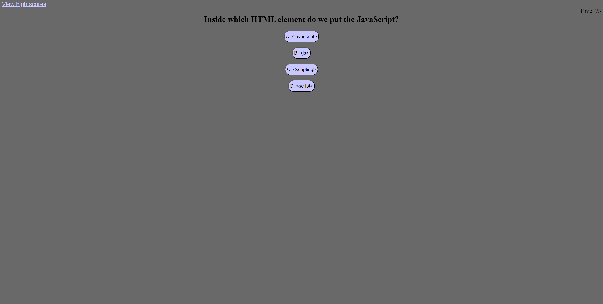

# JavaScript-Quiz-RBC

## Description
Link to deployed app: https://eldenbear.github.io/JavaScript-Quiz-RBC/

This website is a basic JavaScript fundamentals quiz. It has a timer that also acts as the score for the user at the end of the quiz. These scores are stored in local storage so the user can access them and reattempt the quiz to do better. The score is decremented by 10sec for each incorrect answer.

## Usage
Screenshot of quiz question:

